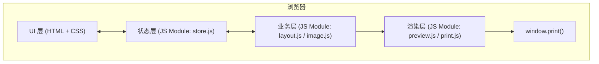

## 1. 架构设计

由于这是一个纯前端的单页工具应用，无需后端服务，架构非常轻量。所有逻辑、状态、视图都运行在浏览器中。

## 2. 技术说明

- **前端**：纯 HTML5 + CSS3 + 原生 ES2020 JavaScript（无任何构建工具与框架依赖）
- **样式方案**：原生 CSS + CSS 变量（用于主题切换与打印适配）
- **图片处理**：使用 `URL.createObjectURL` + `FileReader` 读取本地文件
- **状态管理**：单文件内自实现的轻量观察者模式（`store.js`）
- **后端**：无
- **数据库**：无（图片数据仅在内存中保存，刷新页面后清空）
- **打包方式**：直接 `index.html` 双击即可运行，或通过任意静态服务器托管

## 3. 路由定义

无路由（单页应用），全部功能集中在 `index.html`。

| 视图 | 用途 |
|------|------|
| 主界面 | 上传 + 设置 + 预览 + 打印 |

## 4. 模块划分

| 文件 | 职责 |
|------|------|
| `index.html` | 页面骨架、引入 CSS/JS、定义所有 DOM 结构 |
| `styles.css` | 视觉样式、布局、响应式、@media print 打印样式 |
| `store.js` | 全局状态 + 观察者模式（图片列表、设置项） |
| `layout.js` | 根据设置计算每张图在纸张中的位置与尺寸 |
| `preview.js` | 渲染预览画布 |
| `print.js` | 构造打印专用 DOM、调用 `window.print()` |
| `app.js` | 入口：事件绑定、初始化 |

## 5. 关键实现要点

1. **批量打印原理**：每张发票对应一个 `<section class="print-page">`，使用 CSS `@page` 设置纸张，所有 page 元素按顺序打印。
2. **缩放算法**：
   - `自适应（fit）`：保持比例，完整显示在纸张内
   - `原尺寸（actual）`：按图片原始像素打印，超过纸张部分被裁切
   - `填充（fill）`：保持比例填满纸张，允许裁切
3. **每页多图**：支持 1/2/4 张三种排版（1张=单图全幅；2张=上下分；4张=田字格）
4. **旋转**：CSS `transform: rotate(90deg)`，打印时同步应用
5. **拖拽上传**：监听 `dragover` / `drop` 事件，识别图片 MIME
6. **粘贴上传**：监听 `paste` 事件，从 `clipboardData.items` 提取图片

## 6. 浏览器兼容

- Chrome 100+ / Edge 100+ / Firefox 100+ / Safari 15+
- 依赖：`FileReader`、`URL.createObjectURL`、`window.print()`、CSS `@page`、CSS `calc()`、CSS Grid

## 7. 部署

将整个目录拷贝到任意位置即可运行，或用 `python -m http.server`、`npx serve` 等静态服务器托管。无需 Node 环境，无需构建。
