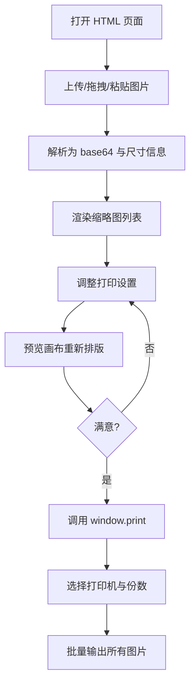

## 1. 产品概述

图片发票批量打印工具是一个纯前端单页应用，旨在帮助财务、报销人员快速将多张电子发票图片（PNG/JPG）按照统一规格批量输出到打印机。

- **核心价值**：无需打开 Word/PDF 等重软件，浏览器内一键完成"导入 → 排版 → 打印"
- **目标用户**：企业财务、行政报销人员，以及需要批量处理电子发票截图的普通用户
- **典型场景**：月底集中打印一周积累的电子发票、统一 A4 规格输出、调整图片方向后送印

## 2. 核心功能

### 2.1 功能模块

1. **首页（单页）**：上传区、画布预览区、设置面板、打印操作区
2. **图片导入模块**：拖拽 / 点击上传 / 粘贴板粘贴
3. **图片管理模块**：缩略图列表、排序、删除、单图旋转
4. **打印设置模块**：纸张规格、方向、边距、缩放模式、起始序号
5. **预览与打印模块**：实时预览所有页面、一键调用浏览器打印

### 2.2 页面详情

| 页面名称 | 模块名称 | 功能描述 |
|---------|---------|---------|
| 首页 | 顶部标题栏 | 工具名称、操作提示、快捷键说明 |
| 首页 | 上传区 | 拖拽 / 选择文件 / 粘贴图片，支持 PNG/JPG/WebP/JPEG |
| 首页 | 设置面板 | 纸张(A4/A5/B5/Letter)、方向(纵向/横向)、边距(mm)、缩放(自适应/原尺寸/填充)、每页图片数(1/2/4)、打印份数 |
| 首页 | 缩略图列表 | 展示已上传图片、文件名、尺寸、序号、上下移、删除、单图旋转 90° |
| 首页 | 预览画布 | 实时显示当前排版结果，按打印纸张比例渲染 |
| 首页 | 底部操作栏 | 打印、清空、恢复默认设置 |

## 3. 核心流程

用户进入页面 → 上传图片（拖拽或选择）→ 缩略图列表显示 → 在设置面板调整纸张/方向/边距/缩放 → 预览画布实时更新 → 点击"打印"调用 `window.print()` → 在打印对话框选择打印机 → 批量输出

## 4. 用户界面设计

### 4.1 设计风格

- **主色调**：墨黑 `#0F0F12` 背景 + 米白 `#F5F1E8` 文字 + 朱砂红 `#C8462E` 强调色
- **辅助色**：薄雾灰 `#9A9690`、纸张米 `#E8E0CC`
- **字体**：标题用思源宋体（Source Han Serif），正文用思源黑体（Source Han Sans）
- **按钮风格**：细描边 + 文字按钮为主，强调按钮使用纯色朱砂红
- **布局风格**：左右分栏（左 320px 设置+缩略图 / 右 弹性预览画布），顶端标题栏，底端操作栏
- **图标风格**：使用细线条 SVG 图标（upload、trash、rotate、print、settings）

### 4.2 页面设计概述

| 页面名称 | 模块名称 | UI 元素 |
|---------|---------|---------|
| 首页 | 顶部标题栏 | 居中标题"发票工坊"，右侧版本号与帮助图标 |
| 首页 | 上传区 | 大块虚线边框，提示"拖拽发票图片至此 / 点击选择 / Ctrl+V 粘贴" |
| 首页 | 设置面板 | 折叠卡片：纸张、方向、边距、缩放、每页图片数、份数 |
| 首页 | 缩略图列表 | 网格布局，每项含缩略图、文件名、序号、上下移、旋转、删除按钮 |
| 首页 | 预览画布 | 白色纸张在深灰背景上，纸张随设置即时变化尺寸 |
| 首页 | 底部操作栏 | 左侧"清空全部"，右侧"打印"主按钮 |

### 4.3 响应式

桌面优先（1280px+），最小支持 1024px 宽度；打印时仅保留打印画布，隐藏所有交互 UI。

### 4.4 打印场景

- `@media print`：隐藏所有控制面板与缩略图，仅输出 A4/A5 等纸张画布
- 使用 CSS `@page` 设置纸张尺寸与边距
- 图片在每页居中，按所选缩放模式自适应
